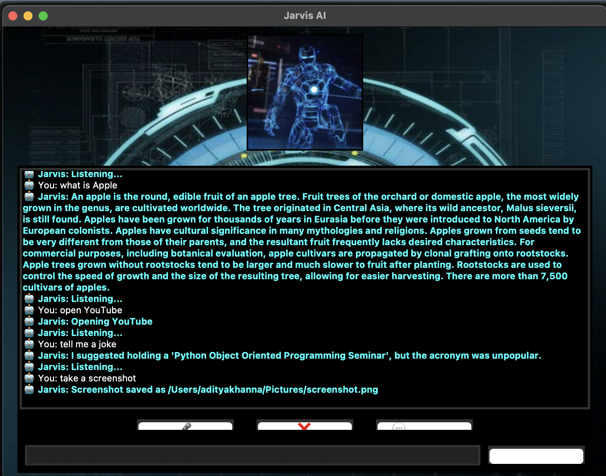

```markdown
# 🤖 Jarvis Desktop AI Assistant

A smart, voice-controlled desktop assistant with a beautiful GUI. Jarvis can take voice and text commands, respond with offline AI, tell jokes, search Wikipedia, play music, and even run a full local chat application between server and client.


---

## ✨ Features

- 🎤 **Voice Commands** using SpeechRecognition
- 💬 **Text Input Bar** for typing queries
- 📦 **Offline Smart Chatbot** (custom logic)
- 📅 Get current **time** and **date**
- 🎵 **Play local music**
- 📷 Take a **screenshot**
- 😂 Tell a **joke**
- 🌐 Open websites like **Google** or **YouTube**
- 📖 Search **Wikipedia**
- 🧠 Ask about **resume tips**, **skills**, and career queries
- 💬 **Local Chat App GUI** with client-server communication
- 🎨 Beautiful **Iron Man–themed GUI**

---

## 🖥 GUI Preview

- `chat_server_gui.py`: Starts the chat server with AI response
- `chat_client_gui.py`: Connects to the server and chats
- Integrated with the main Jarvis GUI via a button

---

## 📁 File Structure

```

Jarvis-Project/
│
├── assets/
│   └── background\_resized.png
│
├── chat\_server\_gui.py   # Server with AI reply
├── chat\_client\_gui.py   # GUI client to chat with server
├── main\_jarvis\_gui.py   # Your main voice assistant file
└── README.md

````

---

## 🚀 Run the Project

1. **Clone the repo:**
   ```bash
   git clone https://github.com/ADITYA-0208/Jarvis-Project.git
   cd Jarvis-Project
````

2. **Install dependencies:**

   ```bash
   pip install -r requirements.txt
   ```

3. **Run Jarvis main GUI:**

   ```bash
   python main_jarvis_gui.py
   ```

---

## 🧠 Example Commands You Can Try

* “Tell me a joke”
* “What’s the date today?”
* “Open Google”
* "Open Youtube"
* “Take a screenshot”
* “Make a resume”
* “Skills to learn in 2025”
* “Play music”

---

## 📦 Dependencies

* `speechrecognition`
* `pyttsx3`
* `wikipedia`
* `pyautogui`
* `pyjokes`
* `requests`
* `pillow`
* `tkinter`
---

## 👨‍💻 Developed By

**Aditya Khanna**
🔗 [GitHub](https://github.com/ADITYA-0208)

### 🧾 Home Page




### 🧾 ChatApp


